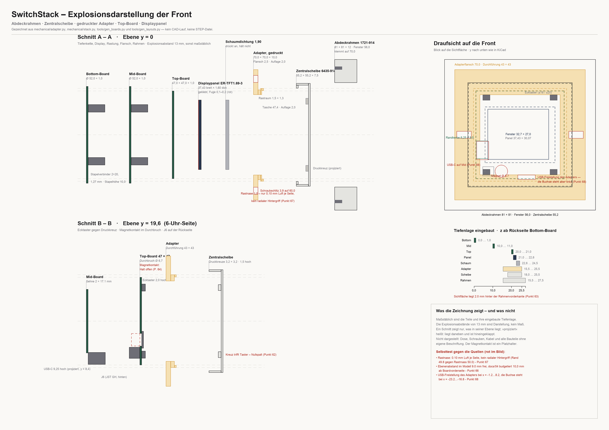

# 18 – Einbaureihenfolge und Kraftfluss der Front

Stand **19.08.2026**. Diese Datei beantwortet zwei Fragen, die bisher über
[`04-mechanical.md`](04-mechanical.md), [`../mechanical/adapter.py`](../mechanical/adapter.py)
und die Kommentare in [`../tools/gen_layouts.py`](../tools/gen_layouts.py) verstreut
waren:

1. **In welcher Reihenfolge wird gefügt** — und an welchen Stellen ist die
   Reihenfolge zwingend, weil sonst etwas nicht mehr zugänglich oder nicht mehr
   montierbar ist?
2. **Wer hält wen** — wo wird geschraubt, geklemmt, geklebt, gerastet oder
   magnetisch gehalten, und wo werden Toleranzen aufgefangen?

Alle Zahlen sind aus dem Quelltext gelesen, nicht nachgerechnet:
`PARAMS` und `_z()` in `mechanical/adapter.py`, die Höhenkette in
`mechanical/stack.py`, die Konstanten `TOP_SQ`, `MAG_X/MAG_Y/MAG_D`,
`NOTCH_*`, `STACK_POS`, `STACK_SIDE` in `tools/gen_layouts.py` sowie das
Messprotokoll F1–F13 in [`04-mechanical.md`](04-mechanical.md) Abschnitt 1d.

> **Was dieses Dokument nicht ist.** Es ist keine Festigkeitsrechnung und kein
> Montageversuch. Jede Aussage, die nicht direkt aus einer Zahl im Quelltext
> folgt, ist unten als **ungeprüft** markiert und in
> [`06-open-decisions.md`](06-open-decisions.md) als Punkt 60–65 nachgetragen.

---

## 1. Die fünf Teile

| Teil | Herkunft | Aufgabe im Verbund |
|---|---|---|
| **Abdeckrahmen 1721-914** | Serienteil, 81 × 81 × 12 mm, Fenster 56,0 (F11) | Sichtblende; klemmt auf den Adapterflansch, verdeckt die Geräteschrauben |
| **Zentralscheibe 6435-914** | Serienteil, 55,2 × 55,2 × 7,5 mm (F1/F2) | Sichtfläche, Tastenbeschriftung, Displayfenster 32,7 × 27,0 — und **das einzige Teil, das ohne Werkzeug abgeht** |
| **3D-Adapter** | `mechanical/adapter.py`, 70 × 70 × 10,0 mm | Tragring, Rahmenhalt und Platinenträger in einem Teil |
| **Top-Board** | 47 × 47 mm, R 4, 1,0 mm dick | trägt Display, vier Ecktaster, ToF, Raumsensor, Magnetkontakt |
| **Displaypanel ER-TFT1.69-3** | 30,07 × 37,43 × 1,6 mm, 12-polige FPC | liegt zwischen Board und Scheibe, **aufgeklebt** |

Die Tiefenkette, von der Sichtfläche nach hinten (`04-mechanical.md` 1e):

```
0,0 … 1,0   Sichtfläche der Zentralscheibe        (F1)
1,0 … 2,5   Druckkreuze auf ihrer Rückseite       (F10, 1,5 hoch)
2,5 … 4,5   SMD-Taster über der Leiterplatte      (2,0 hoch)
4,5 … 5,5   Top-Leiterplatte                      (1,0)
      7,5   Rastebene, hintere Kante der Scheibe  (F2)
```

### Die Zeichnung dazu



Erzeugt von [`../tools/gen_explosion.py`](../tools/gen_explosion.py) →
`renders/front-explosion.png`. Sie enthält zwei Schnittebenen, die Draufsicht
und die eingebaute Tiefenlage.

**Was sie zeigt:** die fünf Teile maßstäblich in Höhe *und* Tiefe, ihre
eingebaute z-Lage, und rot markiert die offenen Punkte an genau der Stelle, an
der sie auftreten.

**Was sie nicht zeigt:** kein 3D. Ein Schnitt zeigt nur, was in seiner Ebene
liegt; alles, was als *projiziert* beschriftet ist, liegt daneben und ist
hineingeklappt. Die Explosionsabstände von 13 mm sind Darstellung, kein Maß.
Nicht dargestellt sind Dose, Schrauben, Kabel und alle Bauteile ohne eigene
Beschriftung. Der Magnetkontakt ist ein Platzhalter (Punkt 64).

Die Zahlen liest das Werkzeug mit `ast` direkt aus `adapter.py`, `stack.py`,
`gen_boards.py` und `gen_layouts.py` — es kann also nicht auseinanderlaufen,
und ein CAD-Lauf ist dafür nicht nötig. Die 57 MB große
`switchstack_stack.step` wird bewusst **nicht** geladen.

**Die Rastebene liegt hinter der Leiterplatte.** Daraus folgt der ganze Aufbau:
Der Schnapprand des Adapters steht hinter dem Board und ist Rastglied und
Auflage in einem. In der Displayfläche gilt eine eigene Kette — 1,90 mm Luft
für die Schaumdichtung, 1,60 mm Panel, 0,1–0,2 mm Klebefuge.

---

## 2. Einbaureihenfolge

### Stufe A — Top-Board vormontieren (alles, was hinterher unerreichbar ist)

| # | Schritt | Warum genau hier |
|---|---|---|
| A1 | **Displaypanel auf die Vorderseite kleben** — doppelseitiges Band umlaufend, 2,40 mm an den langen, 1,05 mm an den kurzen Seiten | Die Klebefläche liegt unter dem Panel. Ist der Stapel gefügt, kommt niemand mehr an sie heran; die Sperrfläche `block_f` hält sie im Layout frei |
| A2 | **FPC um die Boardkante falten und in J5 stecken** (J5 sitzt auf der **Rückseite**, (0 / 3,0)) | Die Fahne ist 18,15 mm lang und laut Zeichnung ohnehin gefaltet. Nach dem Stecken von Mid liegen nur noch 10,0 mm Spalt vor der Buchse |
| A3 | **Magnetkontakt in den Durchbruch Ø 6,7 bei (−10,0 / 19,6) setzen**, Litzen nach hinten | Sein Körper taucht nach hinten in den 10-mm-Spalt; vorn bleibt nur der Flansch. Vor dem Board sind nur 3,50 mm frei — nach dem Stapeln ist der Durchbruch von hinten verbaut. **Wie der Kontakt befestigt wird, ist offen (Punkt 64)** |
| A4 | **Sternlitzen in J6 stecken** (Rückseite, (−17,0 / 19,6)) | Gleicher Grund: J6 zeigt nach hinten zu Mid |

**Zwingend**, weil jeder dieser vier Schritte auf einer Fläche stattfindet, die
danach entweder verklebt (A1) oder von Mid in 10,0 mm Abstand verdeckt ist
(A2–A4). Ob 10,0 mm für Steckerarbeit von der Seite genügen, ist **ungeprüft**
(Punkt 64).

### Stufe B — Stapel fügen

| # | Schritt | Warum genau hier |
|---|---|---|
| B1 | **Top auf Mid stecken** — Stackverbinder bei x = ±14,2, Stapelhöhe 10,0 mm | Mid trägt die USB-C-Buchse auf seiner Vorderseite (3,5 / 20,3); sie **greift durch die Randkerbe** des Top-Boards (6,25 × 9,5 mm, linker Rand). Steckt man verdreht, stößt der Buchsenkörper gegen das Board statt durch die Kerbe |
| B2 | **Mid auf Bottom stecken** — wieder 10,0 mm | Bottom↔Mid trägt keine Sonderteile; die Reihenfolge B1/B2 ist frei tauschbar |
| B3 | **Kabelbaum an den Bottom-Connector** (Micro-Fit 3.0, 2×8) | Hinter Bottom sind laut Tiefenbudget nur 12,0 mm Steckraum plus Kabelbogen vorgesehen; in der Dose ist der Stecker nicht mehr bequem zu treffen |

**Verdrehsicherung übernehmen die beiden Stackverbinder** — sie liegen auf
allen drei Boards deckungsgleich. Eine Codierung A/B ist noch nicht ausgewählt
(Punkt 23), damit ist Verpolungssicherheit derzeit **nicht** gegeben.

### Stufe C — Adapter aufsetzen und in die Dose schrauben

| # | Schritt | Warum genau hier |
|---|---|---|
| C1 | **Adapter von vorn über das Top-Board schieben**, bis das Board auf der 2,0-mm-Auflage aufsitzt | Die Auflage liegt **hinter** dem Board. Der Adapter kann nur von vorn kommen: Seine zentrale Durchführung misst 43 × 43 mm, die Boards messen 47 bzw. Ø 52 — über Mid ließe er sich nicht fädeln. Die Stackverbinder passen mit (16,25 / 13,2) durch die Durchführung, dafür ist sie da |
| C2 | **Lage prüfen: die USB-Freistellung des Adapters muss auf dieselbe Seite wie die Randkerbe zeigen** | Der Adapter ist seit dem 18.08.2026 **nicht mehr punktsymmetrisch**. Die Freistellung (x −1,2 … 8,2, bis y 24,0) liegt auf der 6-Uhr-Seite. Falsch herum stößt der Buchsenkörper vom Mid-Board gegen den Auflagesteg |
| C3 | **Stapel in die Dose einführen und den Adapter mit zwei Geräteschrauben auf 60 mm anziehen** | Die Langlöcher liegen bei x = ±30,0 und damit außerhalb der Boards (r = 26) und außerhalb der Zentralscheibe (55,2) — sie sind nur zugänglich, **solange der Rahmen ab ist** |

### Stufe D — Front schließen

| # | Schritt | Warum genau hier |
|---|---|---|
| D1 | **Abdeckrahmen aufklemmen** — Doppelstege auf 70,0 mm (F13) | Erst nach dem Anziehen: Der Rahmen verdeckt die Schraubschlitze |
| D2 | **Zentralscheibe aufrasten** — vier Nasen auf lichte 50,0 (F8) gegen den Rand 49,8 | Letzter Schritt, und der einzige, der werkzeuglos rückgängig ist. Erst damit ist das Top-Board nach vorn gesichert (siehe Abschnitt 3) |

### Was die Reihenfolge erzwingt — Kurzfassung

* **A vor B**, weil Klebefläche, FPC-Buchse, Magnetdurchbruch und J6 danach im
  10-mm-Spalt liegen.
* **B vor C1** *oder* C1 vor B — geometrisch beides möglich, solange Mid nicht
  vor dem Adapter am Top hängt und der Adapter dann noch übergefädelt werden
  müsste. Praktisch ist B vor C, weil sich der Stapel auf dem Tisch stecken
  lässt.
* **C3 vor D1**, weil der Rahmen die Schrauben verdeckt.
* **D1 vor D2** ist Konvention, keine Zwangsbedingung; ob die Scheibe später
  abgenommen werden kann, **ohne den Rahmen mitzureißen**, ist der ausdrücklich
  offene Teil von Punkt 25.
* **Für den USB-Zugang gilt der umgekehrte Weg nur bis D2:** Scheibe ab, Buchse
  frei. Rahmen und Schrauben bleiben unberührt — genau dafür ist der Aufbau
  gemacht (Punkt 45).

---

## 3. Wer hält wen

Von außen nach innen. Die Spalte **Toleranzglied** sagt, was die Passung
auffängt — und wo nichts steht, fängt nichts auf.

| Fügestelle | Art | Maß | Toleranzglied |
|---|---|---|---|
| **Adapter ↔ Gerätedose** | **verschraubt**, zwei Geräteschrauben nach DIN 49073 | Langlöcher 3,9 mm breit, 7,9 mm über alles, Achsabstand 60,0 | Das Langloch — es fängt die Lochbild- und Verdrehtoleranz der Dose radial auf. **Das gesamte Gerätegewicht hängt hier**, in gedrucktem Kunststoff mit 2,5 mm Flansch (Punkt 51) |
| **Rahmen ↔ Adapter** | **geklemmt**, Doppelstege des Rahmens | Innenmaß 70,0 gegen Flansch 70,0 × 70,0, Ecken R 2,0 | **keines** — Null-Spiel-Paarung. Der Rahmen hält nur sich selbst; F13 nennt die Stege „eher Justierung als Halt". Wie fest er wirklich sitzt: ungeprüft (Punkt 25) |
| **Zentralscheibe ↔ Adapter** | **aufgesteckt** — vier Nasen mittig je Kante, aber **ohne Hintergriff** | Rand außen 49,8 gegen lichtes Rastmaß 50,0 → **0,1 mm Luft je Seite**. Der Rastraum springt zwar 1,5 mm zurück, doch die Nasenspitzen liegen mit 25,0 *außerhalb* der Schulter (24,9) — sie gleiten über den Rand, statt dahinterzugreifen | `rim_play` = 0,2 mm gesamt, ausdrücklich als *Untermaß* geführt. Damit hält die Scheibe rechnerisch nur durch Reibung — **Punkt 67** |
| **Top-Board ↔ Adapter** | **eingelegt und hintergriffen** — Tasche seitlich, Auflage hinten | Tasche 47,4 für Board 47,0 → 0,2 mm je Seite; Auflage 2,0 mm ringsum, unterbrochen von der 9,4 mm breiten USB-Freistellung | `pcb_play` = 0,4 mm gesamt fängt die Fräßtoleranz des Boards auf. **Nach vorn hält nichts** — das übernimmt die Scheibe |
| **Zentralscheibe ↔ Top-Board** | **Anpressung über die vier Druckkreuze** | Kreuze 3,2 × 3,2 mm bei (±18,0 / ±20,0), 1,5 mm hoch, treffen die Taster | **keines** — siehe Abschnitt 4. Die Scheibe ist zugleich das einzige Teil, das das Board am Herausfallen hindert; ist sie ab, liegt das Board lose in der Tasche |
| **Displaypanel ↔ Top-Board** | **geklebt**, doppelseitiges Band umlaufend | 2,40 mm lange Seiten, 1,05 mm kurze Seiten; Klebefuge 0,1–0,2 mm | Die Klebefuge. **Bewusst geklebt und nicht geklemmt:** Die Schaumdichtung in den 1,90 mm davor drückt an, darf aber nicht die Befestigung sein — sonst fällt das Panel heraus, sobald die Scheibe abgenommen wird |
| **FPC ↔ J5** | **gesteckt**, 12-polige FPC-Buchse auf der Rückseite | Fahne 18,15 mm, gefaltet um die Boardkante | Die Faltung. Raster (0,5 oder 0,7 mm) und Pinbelegung sind noch offen (Punkt 15c, `17-bauteildaten.md`) |
| **Magnetkontakt ↔ Top-Board** | **im Durchbruch Ø 6,7 gehalten** — „die Platine hält ihn" (`adapter.py`) | Körper 6,5 + 0,2 Spiel; freier Streifen zwischen Panelkante (y 15,9) und Boardkante (23,5) beträgt 7,6 mm | **Die Befestigungsart ist nirgends festgelegt** — Flansch vorn, Mutter hinten, Kleber? Punkt 64 |
| **Sternstecker ↔ Magnetkontakt** | **magnetisch** | Maße sind Platzhalter (`magnet_d = None`, `magnet_h = 3,0`) | Haltekraft, Abzugskraft und Kontaktwiderstand unbekannt — zum Teil (Elsaybro) gibt es kein Datenblatt |
| **Top ↔ Mid ↔ Bottom** | **gesteckt**, zwei Stackverbinder 2×20, 1,27 mm, Stapelhöhe 10,0 mm | x = ±14,2, y = −2,0; auf allen drei Boards deckungsgleich | **keines, und kein Distanzbolzen** — der Plattenabstand soll aus der Steckhöhe kommen. Das Bauteil ist noch nicht ausgewählt (Punkt 23); heute sitzt dreimal dieselbe Buchse |
| **Mid, Bottom ↔ Dose** | **nichts** | — | Beide hängen ausschließlich an den Stackverbindern am Top-Board, das seinerseits in der Adaptertasche liegt. Die Befestigungsbohrungen M2,5 auf r = 21,5 haben **im Adapter kein Gegenstück** (Punkt 61) |

### Der Kraftweg in einem Satz

Gewicht und Bedienkraft des ganzen Geräts laufen über **zwei gedruckte
Schraubaugen** in die Dose; alles andere hängt in Reihe daran — Rahmen geklemmt,
Scheibe aufgesteckt, Top-Board in der Tasche liegend, Mid und Bottom an zwei
Steckverbindern.

> **Korrektur 19.08.2026.** Hier stand zuvor „Scheibe gerastet, 0,75 mm
> radialer Eingriff je Seite". Die 0,75 mm sind die Stufentiefe des
> Adapterrandes (49,8 gegen Rastraum 48,3), **nicht** der Eingriff der Nasen:
> Deren lichtes Maß ist 50,0 und liegt damit 0,1 mm je Seite *außerhalb* des
> Randes. Aufgefallen beim maßstäblichen Zeichnen — siehe Abschnitt 7 und
> Punkt 67.

---

## 4. Wo Toleranzen aufgefangen werden — und wo nicht

**Aufgefangen wird an vier Stellen:** Langloch (Dose), Taschenspiel 0,4 mm
(Board), Klebefuge 0,1–0,2 mm (Panel) und die 1,90 mm Schaumdichtung vor dem
Panel. Das ist die einzige echte Federung im ganzen Frontaufbau.

**Nicht aufgefangen wird an drei Stellen**, und alle drei sind neu benannt:

1. **Taster gegen Druckkreuz — Nullspalt.** Die Tiefenkette setzt die
   Kreuzunterkante auf 2,5 und die Tasteroberkante ebenfalls auf 2,5. Nominal
   berühren sie sich spannungsfrei. Die Kette hat aber kein nachgiebiges Glied:
   Drucktoleranz der Auflage, Platinendicke ±, Bauhöhe des Tasters und Tiefe der
   Scheibe addieren sich direkt auf den Schaltweg. Zu klein heißt Dauerdruck auf
   allen vier Tastern, zu groß heißt Leerweg und schwammiger Druckpunkt.
   → **Punkt 62, ungeprüft.**
2. **Flansch gegen Rahmen — Null-Spiel-Klemmung** auf 70,0/70,0. Ein FDM-Druck
   fällt üblicherweise über Maß aus; der Rahmen ist ein Spritzteil und gibt
   nicht nach. → gehört zu Punkt 25.
3. **Lage der Sichtfläche im Rahmen.** Der Adapter baut 10,0 mm vor der Wand,
   der Rahmen ist 12 mm tief. Rechnerisch liegt die Sichtfläche der Scheibe
   damit **rund 2 mm hinter der Rahmenvorderkante** — F12 hat am realen Teil
   dagegen „bündig" ergeben. Der Selbsttest prüft nur, dass der Adapter unter
   dem Rahmen verschwindet (`z_total ≤ frame_depth`), nicht, wo die Sichtfläche
   landet. → **Punkt 63, ungeprüft.**

---

## 5. Strompfade über Lagenwechsel — Vias sind nicht beliebig belastbar

Angestoßen am 19.08.2026, gehört ins spätere Routing und ist hier festgehalten,
damit es nicht wieder verlorengeht.

Die Belastbarkeit eines Vias hängt an **Bohrdurchmesser, Kupferdicke in der
Hülse, Länge (also dem Lagenabstand) und der zulässigen Übertemperatur**. Keine
dieser vier Größen ist im Projekt festgelegt:

| Größe | Stand |
|---|---|
| Via-Geometrie | 0,6 / 0,3 mm (`15-bestellung.md`) — als Fertigungsgrenze, nicht als Strombemessung |
| Kupfer der Lagen | 1 oz (`05-manufacturing.md` Abschnitt 1) |
| **Kupferdicke in der Hülse** | **nirgends festgelegt** — sie ist unabhängig von der Lagendicke und beim Fertiger zu bestätigen |
| Lagenaufbau / Bohrlänge | „beim Fertiger zu bestätigen" |
| zulässige Übertemperatur | nicht benannt; `05` warnt nur allgemein, dass Leiterbahnrechner freie Konvektion voraussetzen und in der geschlossenen Dose optimistisch sind |

Die vorhandene Regel lautet: *„Vias in Hochstrompfaden ausreichend dimensionieren
und **mehrfach** setzen"* (`05-manufacturing.md` Abschnitt 2). Das ist eine
Haltung, keine Prüfgröße — ohne Zahl lässt sich nicht feststellen, ob ein Layout
sie erfüllt.

**Wo im Gerät Strom die Lage wechselt** (aus den Platzierungsdaten, das Routing
selbst ist für Mid und Top noch offen):

| Pfad | Warum ein Lagenwechsel unvermeidlich ist |
|---|---|
| **Versorgung auf dem Top-Board** — `5V_SYS`, `3V3_SYS`, `PGND` | Die Stackverbinder sitzen auf der **Rückseite** (`STACK_SIDE["top_ui"] = "B"`), praktisch alle Verbraucher (Display-Backlight, ToF, Raumsensor, Taster) auf der Vorderseite. Jedes Ampere geht durch Vias |
| **Sternpfad** `6V2_STAR_F` → P-FET → PTC → `STAR_OUT` → J6 | `6V2_STAR_F` kommt über **einen einzigen** Stackpin (Pin 13) herauf, die Schaltstufe liegt vorn, J6 liegt hinten. Der Router hat `STAR_OUT` bereits auf B.Cu gelegt (`05-manufacturing.md`) — der Pfad quert also mindestens zweimal die Lage |
| **`USB_VBUS`** | Buchse auf Mid vorn, Weiterführung über den Stack nach Bottom auf **einem** Pin (18) |
| **Motorpfade auf dem Bottom-Board** — `24V_IN±`, `M1_A/B`, `M2_A/B`, Shunt-Rückpfad | 4,1 A Summe, 1,7 A je Motor im Fahrbetrieb. Vierlagig geroutet mit heute 102 Vias; welche davon im Strompfad liegen und wie viele parallel, ist nicht ausgewertet |

**Festzuhalten für das Routing (Punkt 60):** Für jeden dieser Pfade ist die
Zahl paralleler Vias aus dem Strom, der Hülsenkupferdicke und einer *benannten*
Übertemperatur zu bestimmen — und nicht anzunehmen, ein einzelnes Via genüge.
Das gilt besonders dort, wo ohnehin schon ein einzelner Kontakt der Engpass ist
(`6V2_STAR_F`, `USB_VBUS`): Ein Pin und ein Via hintereinander addieren ihre
Erwärmung im selben, luftlosen Volumen.

Die verwandte Frage der **Stackpins** ist getrennt und bereits beantwortet:
[`03-stack-pinout.md`](03-stack-pinout.md) Abschnitt 2 rechnet mit ≈ 1 A je
Kontakt und verteilt `5V_SYS` auf vier Pins. Für Vias gibt es kein Gegenstück
dieser Tabelle.

---

## 6. Was ungeprüft bleibt

| Thema | Punkt |
|---|---|
| Zentralscheibe rastet rechnerisch nicht ein — 0,1 mm Luft statt Hintergriff | **67** |
| USB-Freistellung des Adapters liegt auf der falschen Seite | **68** |
| Ebenenabstand: 9,0 mm im Modell gegen 10,0 mm im Tiefenbudget | **66** |
| Vias in Strompfaden — Bemessung statt „mehrfach setzen" | **60** |
| Halt von Mid und Bottom; Befestigungsbohrungen ohne Gegenstück im Adapter | **61** |
| Nullspalt zwischen Druckkreuz und Taster | **62** |
| Sichtfläche liegt rechnerisch 2 mm hinter der Rahmenvorderkante | **63** |
| Befestigung des Magnetkontakts, Zugänglichkeit von J6 und J5 im 10-mm-Spalt | **64** |
| Widersprüchliche Quellenlage Klinkenbuchse ↔ JST GH ↔ Magnetkontakt | **65** |
| Rasten, Klemmen, Abnehmen am Testdruck | 25 |
| Halten die gedruckten Schraubaugen | 51 |
| Bauhöhe und Außenmaß des realen Displaymoduls | 15c |
| Stackverbinder-Paar samt Codierung und Steckhöhe | 23 |
| Sicherung der Platine gegen Herausfallen bei abgenommener Scheibe | `../mechanical/README.md`, „Was noch fehlt" |

## 7. Was das maßstäbliche Zeichnen zutage gefördert hat

Vier Dinge, die in den Tabellen nicht auffielen, weil dort jede Zahl für sich
richtig ist. Erst nebeneinander gezeichnet stimmen sie nicht zusammen. Alle
vier prüft `gen_explosion.py` jetzt bei jedem Lauf und schreibt sie ins Bild.

1. **Der Adapter saß in `stack.py` 5,5 mm zu weit vorn** — dort stand 21,0, die
   Koordinate der Board*vorder*seite, gefordert ist die Lage der Auflage auf
   der Board*rück*seite: 20,0 − 4,5 = **15,5**. Korrigiert am 19.08.2026, mit
   Gegenprobe: Mit 15,5 fällt die hintere Kante der Zentralscheibe (18,0)
   genau auf die Flanschvorderkante (15,5 + 2,5). Die Baugruppen-STEP ist
   damit neu zu erzeugen — bis dahin zeigte sie den Adapter schwebend.
2. **Die Zentralscheibe rastet rechnerisch nicht ein** (Punkt 67). Ihr lichtes
   Nasenmaß ist 50,0, der Schnapprand 49,8 — die Nasen gleiten mit 0,1 mm Luft
   je Seite über den Rand, statt hinter der Schulter zu greifen. Der
   Selbsttest in `adapter.py` prüft nur, *dass* der Rand hineinpasst, nie,
   *dass* etwas hält.
3. **Die USB-Freistellung des Adapters liegt auf der falschen Seite**
   (Punkt 68). Sie steht bei x = −1,2…8,2 auf der 6-Uhr-Seite; die Buchse ist
   am 18.08.2026 an den linken Rand gewandert (x = −23,2…−16,8, Kerbe
   −23,5…−17,25). Der Adapter stellt heute eine Stelle frei, an der nichts
   steht, und lässt Material dort stehen, wo der Buchsenkörper durchgreift.
4. **Ein Millimeter Unterschied im Ebenenabstand** (Punkt 66): `stack.py`
   setzt die Boards auf 0/10/20 — zwischen Boardvorderseite und nächster
   Boardrückseite bleiben damit 9,0 mm. Das Tiefenbudget in
   [`04-mechanical.md`](04-mechanical.md) Abschnitt 4 rechnet mit 10,0 mm ab
   Boardvorderseite. Eine der beiden Lesarten ist falsch, und welche, hängt
   daran, wie die Stapelhöhe des noch nicht gewählten Verbinders definiert ist
   (Punkt 23).

**Die Quellenlage ist an einer Stelle widersprüchlich** und wurde hier nicht
stillschweigend geglättet: [`04-mechanical.md`](04-mechanical.md) Abschnitte 6b
und 7 sowie [`13-funktionsstatus.md`](13-funktionsstatus.md) beschreiben den
Sternanschluss noch als **2,5-mm-Klinkenbuchse** mit vier Durchbrüchen in der
Scheibe, während `tools/gen_layouts.py`, `mechanical/adapter.py` und
[`17-bauteildaten.md`](17-bauteildaten.md) seit dem 18.08.2026 den **JST GH auf
der Rückseite plus Magnetkontakt im Boarddurchbruch** führen. Dieses Dokument
folgt dem Quelltext, weil er den jüngeren Stand trägt. Aufgenommen als Punkt 65.
